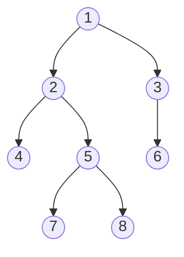
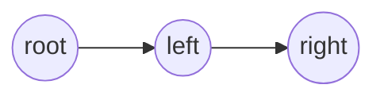
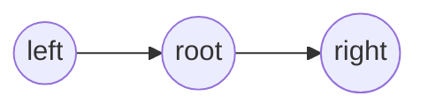
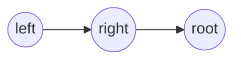

# 树

## 二叉树

### 二叉树的遍历

二叉树是一种重要的数据结构，很多其他数据结构都是基于二叉树的基础演变而来的。对于二叉树，有深度遍历和广度遍历。

由于树的定义本身就是递归定义，因此采用递归的方法去实现树的三种遍历不仅容易理解而且代码简洁。

深度遍历：

- 前序遍历
- 中序遍历
- 后续遍历

广度遍历：

- 只需按层次遍历即可

例：<br>
对于这样一个二叉树：



下面逐个介绍其遍历方式

#### 前序遍历



即先遍历根节点，再遍历左树，右树

代码：

```cpp
void dfs(int u)
{
    int l = v[u].left, r = v[u].right;
    cout << u << ' ';
    if (l) dfs(l);
    if (r) dfs(r);
}
```

结果：`1 2 4 5 7 8 3 6`

#### 中序遍历



即先遍历左树，再遍历根节点，右树

代码：

```cpp
void dfs(int u)
{
    int l = v[u].left, r = v[u].right;
    if (l) dfs(l);
    cout << u << ' ';
    if (r) dfs(r);
}
```

结果；`4 2 7 5 8 1 6 3`

#### 后序遍历



即先遍历左树，再遍历右树，根节点

代码：

```cpp
void dfs(int u)
{
    int l = v[u].left, r = v[u].right;

    if (l) dfs(l);
    if (r) dfs(r);
    cout << u << ' ';
}
```

结果：`4 7 8 5 2 6 3 1`

#### 层次遍历

从上到下一层层遍历

代码：

```cpp
void bfs(int u)
{
    queue<int> q;

    q.push(u);

    while (q.size())
    {
        int t = q.front();
        q.pop();

        int l = v[t].left, r = v[t].right;

        cout << t << ' ';

        if (l) q.push(l);
        if (r) q.push(r);
    }
}
```

结果：`1 2 3 4 5 6 7 8`

### 堆(优先队列)

堆(Heap)通常是一个可以被看做一棵树的数组对象。堆总是满足下列性质：

- 堆中某个结点的值总是不大于或不小于其父结点的值；
- 堆总是一棵完全二叉树。

将根结点最大的堆叫做最大堆或大根堆，根结点最小的堆叫做最小堆或小根堆。常见的堆有二叉堆、斐波那契堆等。

堆是非线性数据结构，相当于一维数组，有两个直接后继。

#### 堆排序

不断返回根节点，返回的顺序即是排序的结果

时间复杂度：$O(mlogn)$

```cpp
#include <iostream>

using namespace std;
const int N = 1e5 + 5;

int a[N];
int n, m, cnt;


void down(int u){
    int t = u;
    if (2 * u <= cnt && a[2 * u] < a[t]) t = 2 * u;
    if (2 * u + 1 <= cnt && a[2 * u + 1] < a[t]) t = 2 * u + 1;
    if (t != u) {
        swap(a[t], a[u]);
        down(t);
    }
}

int main(){

    cin >> n >> m;
    for (int i = 1; i <= n; ++ i)
        cin >> a[i];

    cnt = n; /* cnt 记录堆中节点个数 */
    for (int i = n / 2; i ; i --) down(i); /* 从 n / 2 向上down */

    while (m--){
        cout << a[1] << ' ';
        a[1] = a[cnt --]; /* 先交换根和最后一个节点, 再把最后一个节点删除*/
        down(1);
    }
    return 0;
}
```

> 建堆：
> 从 n / 2 向上 down 的原因：
>
> - n 为 n / 2 的叶节点， 叶节点一定满足堆性质
> - 只有叶节点满足堆性质的节点执行 down 才有意义
>   综上可知，从 n / 2 是最大的，能进行 down 操作的节点，由下而上地 down 操作能保证每一次操作都是有意义的

#### 模拟堆

[Acwing 839. 模拟堆](https://www.acwing.com/problem/content/841/)

```cpp
#include <iostream>
using namespace std;
const int N = 1e5 + 5;

int h[N], ph[N], hp[N], si, cnt;

/* 题目引入了第几个插入的数，所以需要使用额外的指针 */
void heap_swap(int a, int b){
    swap(ph[hp[a]], ph[hp[b]]);
    swap(hp[a], hp[b]);
    swap(h[a], h[b]);
}

void down(int u){
    int t = u;
    if (2 * u <= si && h[2 * u] < h[t]) t = 2 * u;
    if (2 * u + 1 <= si && h[2 * u + 1] < h[t]) t = 2 * u + 1;
    if (u != t) heap_swap(t, u), down(t);
}

void up(int u){
    while (u / 2 && h[u / 2] > h[u]) {
        heap_swap(u / 2, u);
        u /= 2;
    }
}

int main(){
    int n;
    cin >> n;
    while (n --) {
        string op;
        cin >> op;
        int k, x;
        if (op == "I") {
            cin >> x;
            ph[++ cnt] = ++ si, hp[si] = cnt;
            h[si] = x;
            up(si);
        } else if (op == "PM") cout << h[1] << endl;
        else if (op == "DM"){
            heap_swap(1, si --);
            down(1);
        } else if (op == "D") {
            cin >> k;
            k = ph[k];
            heap_swap(k, si --);
            down(k), up(k);
        } else {
            cin >> k >> x;
            k = ph[k];
            h[k] = x;
            down(k), up(k);
        }
    }
    return 0;
}
```

### 哈夫曼树(Huffman)

&emsp;&emsp;霍夫曼编码（Huffman Coding），又译为哈夫曼编码、赫夫曼编码，是一种用于无损数据压缩的熵编码（权编码）算法。

&emsp;&emsp;为了压缩字符串传输成本，用贪心的思路，将使用不频繁的字符用较长的二进制数表示，常用的字符用较短的二进制数表示，从而达到减少二进制使用，降低传输成本的目的。

由此选择元素顺序建成的二叉树称为 Huffman Tree


#### 建树

<mark>
基本思路：权值高的叶节点靠近根节点，权值低的叶节点远离根节点
</mark>

步骤：

1. 排序
2. 权值小的节点优先合并为一个节点

重复两个步骤，直到只剩下一个节点，该节点就是根节点，沿合并节点的顺序返回就可以得到一个 Huffman Tree

## 多叉树

## 森林

### 并查集

基本的并查集支持两个操作，合并和查找, 即把两个集合合并，查找两个数是否在同一个集合

也可以看成是树的合并与查找

这个模板通过路径压缩，把查询的时间复杂度降为`O(1)`, 查询的时只要判断两个数所在的集合的根节点是否相同，相同则说明在同一个集合

```cpp
#include <iostream>

using namespace std;
const int N = 1e5 + 5;
int p[N]; // 父节点

int find(int x){
    if (p[x] != x) p[x] = find(p[x]); // 如果当前节点有父节点则把它的父节点换成它的祖宗节点，这是优化的关键，即把一棵树每个节点都指向根节点, 查找的时间复杂度优化到O(1)
    return p[x];
}

int main(){

    int n, m;
    cin >> n >> m;

    for (int i = 0; i < n ; i ++) p[i] = i;

    while (m --){
        char op;
        int a, b;
        cin >> op >> a >> b;
        else {
        if (op == 'M') p[find(a)] = find(b); // b树的根节点 作为 a树的父节点
            if (find(a) == find(b)) puts("Yes");
            else puts("No");
        }
    }

    return 0;
}
```

#### 连通块中点的数量

[837. 连通块中点的数](https://www.acwing.com/problem/content/description/839/)

```cpp
#include <iostream>

using namespace std;
const int N = 1e5 + 5;

int p[N], cnt[N];  // 多加了一个数组用来维护集合中点的数量，注意只有根节点的数量才有意义

int find(int x){
    if (p[x] != x) p[x] = find(p[x]);
    return p[x];
}

int main(){

    int n, m;
    cin >> n >> m;

    for (int i = 1 ; i <= n ;i ++)
        p[i] = i, cnt[i] = 1;

    while (m --){
        string op;
        int a, b;
        cin >> op;

        if (op == "C"){
            cin >> a >> b;
            a = find(a), b = find(b); // 如果没有先取根节点，那么下面的操作必须先加数量再连线，否则会导致根节点重叠加数量错误
            if (a == b) continue;
            p[a] = b;
            cnt[b] += cnt[a]; // 连线时把根节点的数量加过去
        } else if (op == "Q1") {
            cin >> a >> b;
            if (find(a) == find(b)) puts("Yes");
            else puts("No");
        } else {
            cin >> a;
            cout << cnt[find(a)] << endl;
        }
    }

    return 0;
}
```

####

```cpp
#include <iostream>

using namespace std;
const int N = 50005;
int p[N], d[N], idx;

int res;

int find(int x) {
    if (p[x] != x) {
        int u = find(p[x]);
        d[x] += d[p[x]];
        p[x] = u;
    }
    return p[x];
}

int main(){
    int n, m;
    cin >> n >> m;

    for (int i = 1; i <= n; i ++) p[i] = i;

    while (m --){
        int t, x, y;
        cin >> t >> x >> y;
        if (x > n || y > n) res ++;
        else {
            int px = find(x), py = find(y);
            if (t == 1) {
                if (px == py && (d[x] - d[y]) % 3) res ++;
                else if (px != py) {
                    p[px] = py;
                    d[px] =  d[y] - d[x];  /* d[x] + d[px] === d[y] (mod 3) */
                }
            } else {
                if (px == py && (d[x] - d[y] - 1) % 3) res ++;
                else if (px != py) {
                    p[px] = py;
                    d[px] = d[y] - d[x] + 1; /* d[x] + d[px] === d[y] + 1 (mod 3) */
                }
            }
        }
    }

    cout << res << endl;
    return 0;
}
```

#### 食物链

[Acwing 240. 食物链](https://www.acwing.com/activity/content/problem/content/887/)

使用节点到根节点的距离表示关系，`mod 3` 下：

- 等于 0 即 与根节点同类
- 等于 1 即 能吃根节点
- 等于 2 即 能被根节点吃

```cpp
#include <iostream>

using namespace std;
const int N = 50005;
int p[N], d[N], idx;

int res;

int find(int x) {
    if (p[x] != x) {
        int u = find(p[x]);
        d[x] += d[p[x]];
        p[x] = u;
    }
    return p[x];
}

int main(){
    int n, m;
    cin >> n >> m;

    for (int i = 1; i <= n; i ++) p[i] = i;

    while (m --){
        int t, x, y;
        cin >> t >> x >> y;
        if (x > n || y > n) res ++;
        else {
            int px = find(x), py = find(y);
            if (t == 1) {
                if (px == py && (d[x] - d[y]) % 3) res ++;
                else if (px != py) {
                    p[px] = py;
                    d[px] =  d[y] - d[x];  /* d[x] + d[px] === d[y] (mod 3) */
                }
            } else {
                if (px == py && (d[x] - d[y] - 1) % 3) res ++;
                else if (px != py) {
                    p[px] = py;
                    d[px] = d[y] - d[x] + 1; /* d[x] + d[px] === d[y] + 1 (mod 3) */
                }
            }
        }
    }

    cout << res << endl;
    return 0;
}
```
